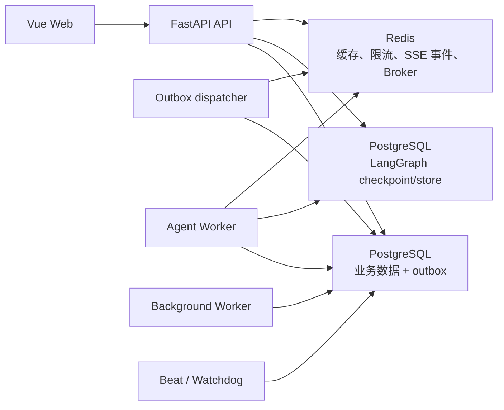

# ContentAI 技术设计

> 本文描述当前 `apps/api`、`apps/web`、`infra` 与 `tools` 布局下的实现。日常开发、部署和故障排查分别见 [开发指南](DEVELOPMENT.md) 与 [运行手册](OPERATIONS.md)。

## 设计原则

1. 对话消息是唯一内容交付面，最终稿件也是普通 Assistant 消息。
2. PostgreSQL checkpoint 只保存可恢复的图执行技术状态，不演化为内容工作流数据库。
3. 所有异步投递通过事务 outbox 衔接数据库与 Broker，允许安全重试。
4. 每次写入或恢复都验证用户、会话、Agent、execution 和 checkpoint 的一致性。
5. 工具输出不复制进审计表；研究资料包作为明确例外持久化，供下一轮完整加载。

## 运行架构

- FastAPI 负责认证、Agent/会话边界校验、写入用户消息和创建 execution/outbox。
- Dispatcher 只发布已提交的 outbox；发布失败的记录继续保持待投递状态。
- Agent Worker 领取 execution 或恢复请求，刷新租约，执行 LangGraph，并持久化 Assistant 消息。
- Background Worker 执行标题、累积摘要和长期记忆后处理。
- Beat/Watchdog 仅处理已经发布但超时未领取、租约失效或后处理超时的任务；未发布 outbox 不会被提前判失败。

## 发送与恢复

### 新消息

1. API 校验认证用户有效，加载 session 和 Agent。
2. 校验 `session.agent_id == request.agent_id`；失败返回 `SESSION_AGENT_MISMATCH`，事务中不产生任何消息或执行。
3. 在一个事务中写入用户消息、invocation、execution 和 `execute` outbox。
4. Dispatcher 发布后，Worker 重新校验用户状态及 execution/session/Agent/AgentVersion 关系，再领取执行。
5. Worker 使用 session 的 `langgraph_thread_id` 读写 PostgreSQL checkpoint，完成后保存 Assistant 消息并创建后处理 outbox。

### 人工确认恢复

1. API 校验用户、session、Agent、execution 均匹配，并将恢复值写入 `ExecutionResumeRequest`。
2. Worker 领取恢复请求后，对照 checkpoint 中真实的 pending interrupt，校验 interrupt 标识和待确认工具集合哈希。
3. 恢复输入在 checkpoint 确认推进前保持可重试；成功推进后才标记 consumed。
4. Worker 在消费前或消费后崩溃时，租约和恢复请求状态允许另一个 Worker 重新领取。
5. 副作用工具以 `(execution_id, tool_call_id)` 为幂等键，重放不重复执行副作用。

## 对话式内容流程

内容流程由系统提示词、当前会话消息和两个公开工具协作完成，不保存 `stage` 字段。Metaso 与 Anspire 搜索工具仅供研究编排层调用，不暴露给主 Agent。

- `fetch_hotspots`：采集 → 每来源截断 → 逻辑平台轮询公平合并 → 全局去重与稳定 `candidate_id` → 一次性结构化评分 → 仅返回达标选题。成功缓存默认 180 秒，失败短缓存 15 秒。
- `prepare_topic_research`：并发调用固定 endpoint 的 Metaso 与 Anspire → 规范化并按 URL 去重 → 清理/隔离不可信供应商文本 → 以独立 JSON 证据块输入研究子模型 → 固定模板归纳 → 机械清理未知引用 → 幂等持久化 `ResearchPackage`。研究不访问结果 URL，不做域名独立性、原始信源或证据充分性判断。
- 主模型将工具结果整理为 Assistant 消息。首次跳过研究的劝告、后续坚持以及选题切换都从会话消息历史判断。

两个搜索 API 使用可取消的异步 HTTP、关闭自动重定向，并共享 30 秒搜索 deadline；结构化归纳最多 135 秒，研究总 deadline 为 180 秒。搜索结果 URL 仅作为引用数据，服务端不会请求或解析 DNS。资料包只保存清理限长后的搜索字段，不存在网页正文数据。

## 上下文与摘要

- 最近消息按上下文预算装载。
- 长对话使用带消息游标的累积摘要：新摘要合并已有摘要和游标之后的消息，而不是重新截取最近窗口。
- 早期用户约束因此能跨窗口压缩保留；摘要仍属于会话记忆，不是研究包或稿件产物。
- `ToolMessage` 不作为独立聊天消息持久化；对用户有价值的结果由主模型生成 Assistant 消息。
- 下一轮会额外加载会话最新 `ResearchPackage`，以只读 HumanMessage 数据块注入完整结构化资料、来源快照和诊断，不依赖上一轮 Assistant 转述。

## 工具边界与审计

- 主模型最大迭代数、单工具超时和工具输出字符上限在执行包装层强制执行；研究工具采用 cooperative timeout，不进入不可中断的外层线程池。
- 超时或超限转为结构化工具错误返回主模型，并停止失控循环。
- `ToolExecution` 只记录工具名、`tool_call_id`、参数哈希、结果摘要哈希、状态、耗时和错误；原始参数与结果字段仅兼容历史数据，新执行不写入内容正文。
- 搜索引用必须来自本轮工具结果；未知引用会被移除。来源数量、域名和来源类别不构成结论门槛。

## 删除、安全与限流

- 删除空闲 session 时，在事务内硬删除消息、执行、恢复请求、尝试、工具审计、事件和关联记忆；事务提交后删除对应 LangGraph thread。
- 保留的 `AdminAuditLog` 墓碑仅含不可逆目标哈希和操作元数据。
- 禁用用户时使验证令牌和登录会话失效，取消排队/待确认任务，并为运行中任务设置取消请求；Worker 在安全边界终止。
- LLM 限流使用稳定的认证用户 scope，并叠加可配置日预算。验证邮件重发分别按用户、规范化邮箱和 IP 限流。
- 最后一个管理员的降权或禁用操作使用 PostgreSQL 事务级 advisory lock 串行化。

## 数据库与部署

- `202607150001` 为会话增加非空 `agent_version_id` 并创建 `ResearchPackage`；历史会话优先回填最近 execution 的版本，空会话回填当前最新版本。
- LangGraph checkpoint/store 表由 `PostgresSaver.setup()` 初始化，并从 Alembic autogenerate 比较中明确排除。
- 清理业务数据只能运行独立管理命令并显式确认，不能通过 Alembic 触发。
- 容器启动顺序为 PostgreSQL 健康 → 一次性 migration 成功 → API、Dispatcher、Worker 和 Beat 启动。
- readiness 检查数据库 revision、checkpoint schema、Redis、队列连接及 outbox 最老积压时间。
- Celery Beat 调度文件位于运行目录 `/tmp`，不写入源码目录。
