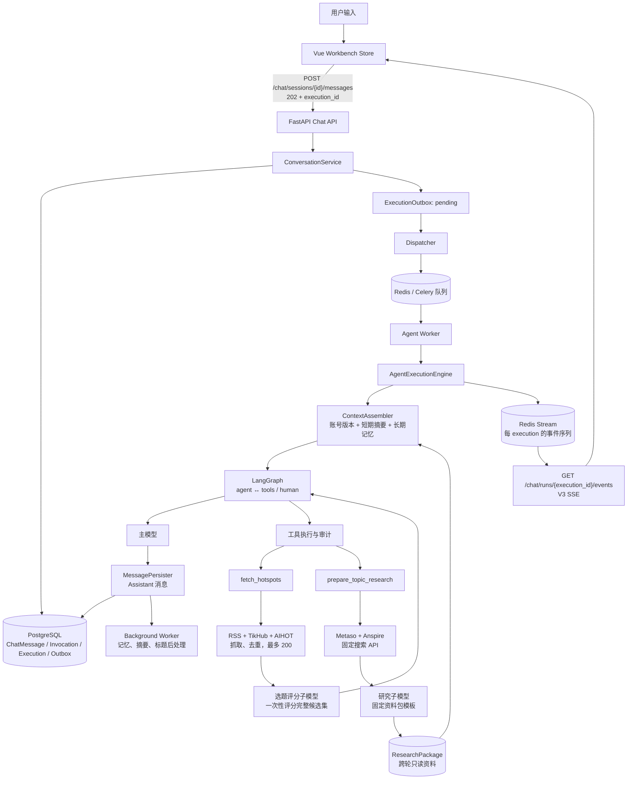

# 会话到内容生成：当前代码链路与风险梳理

更新日期：2026-07-15。本文仅依据当前仓库 `apps/api`、`apps/web` 与已部署的 Compose 服务整理。

## 1. 结论摘要

ContentAI 是“会话驱动、异步执行、事件回放”的内容助手，不存在固定阶段工作流。一次用户消息会创建一个执行记录，由 Dispatcher 投递给 Agent Worker；会话在创建时固定 AgentVersion，Worker 用该版本、会话上下文和记忆运行 LangGraph。热点筛选、资料检索和最后内容生成都在同一个会话图中完成。最终成果以 Assistant 消息持久化并通过 V3 SSE 回传，完整研究依据额外保存在 `ResearchPackage` 中供后续轮次只读加载。

当前热点链路已调整为：各逻辑平台按轮次公平合并并去重（最多 200 条），一次性输入选题评分子模型。每条输入包含稳定 `candidate_id` 与 `title`、原文 `url`、`summary`、`platform`、`published_at`；子模型只返回达标好选题并保持评分顺序。

研究链路只访问 Metaso、Anspire 和研究模型 API，不访问搜索结果网页；搜索与归纳均使用可取消异步任务和共享 deadline。

## 2. 全链路图

## 3. 分段设计

### 3.1 前端会话与提交

- 入口在 `apps/web/src/stores/workbench.ts`。前端先确保会话绑定当前账号，再调用 `api.sendMessage()`。
- `POST /api/chat/sessions/{session_id}/messages` 返回 `202`，其中有 `message_id`、`execution_id` 和初始状态；这表示已持久化并入队，不表示 Worker 已开始运行。
- Store 会创建一个 Assistant 占位消息，状态通常从 `pending` 变为 `streaming`、`completed`、`failed` 或 `waiting_input`。
- SSE 使用 `FetchEventStream` 解析 fetch 流，不使用浏览器原生 `EventSource`，原因是请求要携带 Cookie/CSRF 语义并支持自定义请求头。

### 3.2 API 与事务边界

关键入口：`apps/api/src/api/chat.py` 与 `apps/api/src/services/conversation_service.py`。

提交消息时，服务在业务数据库中创建或关联以下数据：

| 实体 | 作用 |
| --- | --- |
| `ChatMessage` | 用户消息和最终 Assistant 消息 |
| `AgentInvocation` | 一次用户触发与会话、账号版本的关联 |
| `AgentExecution` | 可运行、可取消、可恢复的执行单元 |
| `ExecutionOutbox` | 将数据库事务可靠地交给异步队列的待投递记录 |
| `ResearchPackage` | 保存清理后的双搜索快照、结构化结论、诊断和渲染资料包 |

同一会话只允许一个忙碌执行（`pending`、`running`、`waiting_input`），因此连续点击发送会得到冲突，而不是创建并行的上下文竞争执行。`Idempotency-Key` 用于避免网络重试制造重复消息。

### 3.3 Outbox、Dispatcher 与 Worker

- `services/dispatcher.py` 轮询 `ExecutionOutbox`，用 `FOR UPDATE SKIP LOCKED` 声明投递所有权。
- 成功后投递 `contentai.execute_agent` 到 Agent 队列；投递失败则指数退避，最长 60 秒后重试。
- Worker 在 `agent/runtime/execution_services.py` 中重新读取执行、会话、用户消息与账号版本，而不是相信队列消息中的业务内容。
- 完成主执行后，再写入 `postprocess` Outbox，由 Background Worker 处理记忆抽取、短期摘要和会话标题；处理失败按 5/10 秒退避，最多执行 3 次。Broker 投递 `attempts` 与实际处理 `processing_attempts` 分开记录，最终失败不改变主执行的 completed 状态。

### 3.4 上下文、图与内容生成

`ContextAssembler` 组成以下输入：账号描述、会话固定版本的内容提示词、会话窗口、短期摘要、最多 8 条相关长期记忆、最新完整研究资料包，以及当前用户消息。研究资料包作为只读 HumanMessage JSON 数据块装载，不依赖上一轮 Assistant 摘要或 ToolMessage checkpoint。

LangGraph 定义在 `apps/api/src/agent/graph`：

1. `agent`：主模型生成回复或工具调用；可对可重试模型流错误重试最多 3 次。
2. `tools`：执行模型请求的工具；失败时写入错误 `ToolMessage`，再回到 `agent` 让模型处理失败。
3. `human`：需要人工确认的工具会触发 LangGraph interrupt，执行状态变为 `waiting_input`。
4. `tool_error`：避免在某些模型上以错误的 Assistant prefill 继续请求。

图的总模型迭代次数受 `agent.max_iterations` 控制。最终文本由 `MessagePersister` 校验并持久化，之后才发送 `assistant_message_delta` 与 `assistant_message` 事件。若图产生的消息没有可展示 Assistant 文本，会写入一个可展示的 fallback 文本。

### 3.5 热点到选题评分

入口：`apps/api/src/agent/tools/hotspots.py`。

1. 根据账号版本的 `tools_config.hotspot_sources` 选择来源；未配置时默认 23 个逻辑平台：18 个 RSS、4 个 TikHub 平台和 AI HOT。
2. 每个平台内部保留原始 rank；平台间逐轮各取一条，每轮起点循环偏移。失败、数据不足和重复候选释放出的容量由其他平台继续补齐，总上限 200 条。
3. 全局去重时合并来源信息，并为唯一候选生成稳定、无业务语义的 `candidate_id`。
4. `normalize_hotspot_candidates()` 向评分模型提供 `candidate_id` 与 `title`、`url`、`summary`、`platform`、`published_at`。
5. `hotspot_filter_model` 用 `topic_scoring_prompt` 一次性浏览完整评分池，只返回达到标准的 `selected_candidates`；不输出未入选评价或淘汰列表。
6. 后端按 `candidate_id` 恢复原始链接并保持模型顺序；空选择是正常结果，主模型不重新评分或排序。

工具运行会发出 `tool_start`、`tool_progress`、`tool_end`。热点工具细分为“采集来源”“选题评分”“整理结果”阶段，前端活动条显示 `source_health`、各平台采集数与进入评分池数量。

### 3.6 双搜索到研究资料包

入口：`apps/api/src/agent/tools/research.py` 与 `agent/workflows/deep_research.py`。

1. `prepare_topic_research` 同时调用仅供编排层使用的 `search_metaso_sources` 和 `search_anspire_sources`；两者 endpoint 固定、只接受主题和数量、禁用重定向，共享最多 30 秒。
2. 结果按规范化 URL 去重，并由 URL 派生稳定 `source_id`。引用 URL 只做无凭据 HTTP/HTTPS、标准端口和明显本地/私网/元数据地址格式检查，绝不由服务端请求。
3. 标题、摘要和站点名会清理控制字符、零宽/双向字符、HTML 残片及超长字段；命中提示注入特征的来源只保留 URL 与隔离诊断，不送入模型。
4. 可用结果作为独立 JSON 数据块交给研究子模型，最多 135 秒，输出固定结构。后端只移除不在本轮来源集合中的引用，不做独立域、原始信源、交叉支持或 `insufficient` 判断。
5. 单提供商单结果也可生成资料包；双方均失败或没有可用文本时返回 `SEARCH_NO_RESULTS`。成功结果以 `(execution_id, topic_hash)` 幂等写入 `ResearchPackage`。

### 3.7 V3 SSE 与断线恢复

事件由 `PersistentAgentEventWriter` 写进 Redis Stream；每个执行拥有递增的 sequence。API 将内部事件投影为 V3 通道：

| V3 通道 | 主要事件 |
| --- | --- |
| `messages` | Assistant 增量与最终消息 |
| `tools` | 工具开始、进度、结束 |
| `lifecycle` | run/attempt 开始、完成、取消、重试、恢复 |
| `interrupts` | 等待人工确认 |
| `errors` | 执行错误 |
| `values` | 其他值与诊断事件 |

前端将复合事件 ID（如 `execution_id:12`）解析为序列号 `12`，普通断线先查询轻量 `/runs/{id}/status`，再用 `after_sequence` 续订。Redis 降级、回放过期或缺口不视为执行失败，Store 改为每 3 秒刷新状态；发现终态后重新加载会话和最终回复。

## 4. 已知问题与高风险点

| 优先级 | 环节 | 风险/现象 | 代码依据与建议 |
| --- | --- | --- | --- |
| P0 | 热点评分输出 | 已改为浏览全部候选、只返回达标好选题，不再为未入选候选逐条输出评价。 | 回归测试锁定单次完整输入、可变数量输出与模型顺序。 |
| P0 | SSE/Redis | Redis 发布失败会把执行标为 `streaming_degraded`，实时事件停止；用户只能通过轮询执行状态或刷新会话看到最终结果。 | 监控 `streaming_degraded`、Redis 发布错误、SSE 回放过期/缺口；告警并展示“已降级为状态刷新”。 |
| P1 | 外部热点源 | 单源网络、RSS 格式或第三方限流仍可能失败；LatePost 在 RSSHub 失败后尝试官网 HTML。 | 通过 `source_health` 展示成功、降级、失败、耗时、采集数和入池数。 |
| P1 | 热点候选身份 | 已使用稳定 `candidate_id` 关联评分结果。 | 同标题、不同 URL 保持独立，不再按标题覆盖。 |
| P1 | 长任务体验 | `202` 到 `run_start` 之间受 Outbox 轮询、Celery 排队、Worker 可用性影响；用户会看到“提交中”。 | 记录 `request_to_running_ms`，按 pending 时间、Outbox 年龄、队列深度告警；前端显示“已入队/等待 Worker”。 |
| P1 | 热点工具超时 | 通用同步工具仍可能在线程池中执行，已开始的同步 HTTP 请求不能靠 `future.cancel()` 强制中断。研究工具已改为 cooperative timeout，不受此问题影响。 | 热点抓取继续使用严格连接/读取超时并记录单源耗时。 |
| P1 | 断线体验 | `FetchEventStream` 负责一次 fetch 流读取，本身不提供无限重连循环；Store 负责恢复状态。 | 保留并扩展“断线 → run 状态查询 → 以最后 sequence 重订阅”的契约测试。 |
| P2 | 会话上下文 | 长期记忆按关键词相关性选择；中文分词采用二元片段，可能错过语义相关但词面不相近的记忆。 | 对召回命中率、被注入记忆数量和上下文 token 使用量埋点；必要时采用向量召回。 |
| P2 | 后处理 | 记忆、摘要和标题在主回复后异步执行，可能失败或滞后，但不会影响本轮内容。 | 单独监控 postprocess Outbox 的 pending/failed/oldest age，避免长期积压。 |

## 5. 当前排查路径

当用户反馈“任务提交后很久没有内容”时，按以下顺序判断：

1. 查 `AgentExecution.status`、`created_at`、`first_event_at`、`first_token_at`：区分未被 Worker 领取与模型/工具慢。
2. 查 `ExecutionOutbox.status`、`attempts`、`last_error`、`available_at`：确认 Dispatcher 是否投递。
3. 查 Agent Worker、Dispatcher、Redis 健康与队列积压。
4. 查 Redis Stream 的 sequence、TTL、事件类型：确认是否发出 `run_start`、工具进度、token、终态。
5. 查 `ToolExecution`：热点工具的开始/结束/超时，以及 `sources.errors` 中的来源失败。
6. 查 `AgentExecutionAttempt` 和模型用量/运行时 marker：定位模型重试、图迭代过多或结构化评分耗时。
7. 最后查前端：V3 通道监听、复合 `Last-Event-ID`、当前 `execution_id` 是否仍是活动会话。

## 6. 建议的验收与监控指标

最低限度应持续观察：

- `request_to_running_ms`：P50/P95，识别队列问题。
- `first_event_at - created_at` 与 `first_token_at - created_at`：区分 Worker、工具和模型慢。
- 热点按来源的成功数、失败数、耗时、去重后数量及进入评分数量。
- `hotspot_filter` 的输入候选数、模型耗时、输出 token、解析失败率和达标选题数量。
- `streaming_degraded`、`StreamReplayExpired`、`StreamReplayGap`、SSE backpressure 断开数。
- Outbox pending 数、最老 pending 时长、重试次数；两个 Celery 队列的积压和 Worker 心跳。
- `AGENT_MAX_ITERATIONS_EXCEEDED`、工具超时、人工确认等待时长。
- Metaso/Anspire 分项耗时、错误与结果数，隔离来源数、未知引用移除数、`SEARCH_NO_RESULTS` 和研究模型耗时。

## 7. 关键文件索引

| 主题 | 文件 |
| --- | --- |
| HTTP / SSE 边界 | `apps/api/src/api/chat.py` |
| 会话、执行、Outbox | `apps/api/src/services/conversation_service.py` |
| Dispatcher | `apps/api/src/services/dispatcher.py` |
| Redis 事件流 | `apps/api/src/services/event_stream.py` |
| Worker 执行编排 | `apps/api/src/agent/runtime/execution_services.py` |
| LangGraph | `apps/api/src/agent/graph/factory.py`、`nodes.py`、`edges.py` |
| 工具审计/超时/进度 | `apps/api/src/agent/runtime/tool_execution.py` |
| 热点抓取 | `apps/api/src/integrations/hotspot/hotspots.py` |
| 选题评分 | `apps/api/src/agent/tools/hotspots.py`、`hotspot_filter.py` |
| 双搜索与研究归纳 | `apps/api/src/integrations/search/search.py`、`agent/workflows/deep_research.py` |
| 研究资料包持久化 | `apps/api/src/models/research.py`、`agent/workflows/research_repository.py` |
| 前端 API/SSE 解析 | `apps/web/src/services/api.ts` |
| 前端会话 Store | `apps/web/src/stores/workbench.ts` |
