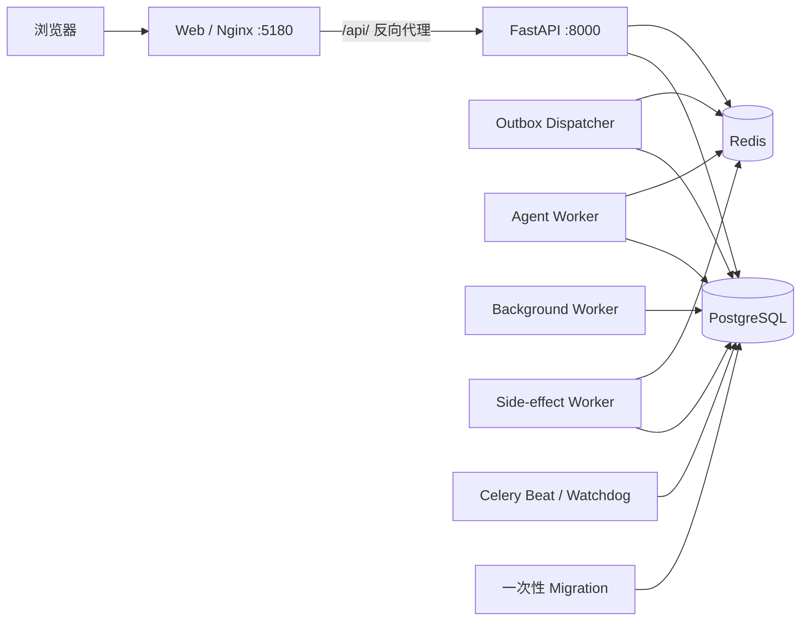

# 架构与目录

## 服务拓扑

`compose.yaml` 负责启动 PostgreSQL、Redis、迁移服务、API、Dispatcher、三个 Worker（`agent-worker`、`background-worker`、`side-effect-worker`）、Beat 与 Web，共十个服务。迁移成功是 API 和后台服务的启动前提；Web 仅在 API 就绪后启动。`compose.dev.yaml` 只为本地开发在 loopback 暴露数据库、Redis 和 API。

全局 OpenAI-compatible 模型配置保存在 PostgreSQL：唯一 active 配置及保留的历史版本完整包含 endpoint、凭据引用、模型名、Temperature、上下文窗口和两类输出上限，并由 `model_config_id` 关联到 execution/outbox。运行时只读取该固化版本，不读取模型环境变量。`CONTENTAI_MODEL_CONFIG__ENCRYPTION_KEY` 通过 Compose 的共享应用环境传入 migration、API、dispatcher、worker 和 beat；这些服务必须使用同一 Fernet key 才能读取加密的模型 API Key。

## 目录职责

| 路径 | 职责 |
| --- | --- |
| `apps/api/src/api` | HTTP 路由、认证依赖与 SSE 边界 |
| `apps/api/src/agent` | LangGraph 组装、执行恢复、工具与提示词 |
| `apps/api/src/services` | 会话、执行、outbox、任务、迁移和运维服务 |
| `apps/api/src/models` | SQLAlchemy 实体与 API Schema |
| `apps/api/src/contentai_migrations` | 可随 wheel 安装的单一业务初始迁移；不管理 LangGraph checkpoint/store 表 |
| `apps/api/tests` | 后端单元、集成与可靠性测试 |
| `apps/web/src` | Vue 页面、状态管理和 API 客户端 |
| `infra` | API/Web Dockerfile 与 Web Nginx 反向代理 |
| `tools` | Windows 开发、测试、评审和 Ubuntu 发布打包入口 |
| `infra/ubuntu` | Ubuntu 部署、健康检查、备份、恢复和升级脚本 |

## 对话执行链路

1. Web 创建或加载一个明确绑定 Agent 的会话。
2. 发送消息必须携带 `agent_id`；API 校验它与会话的 Agent 一致后，在一个数据库事务内写入消息、执行记录和 outbox。
3. Dispatcher 将已提交的 outbox 发布至 Redis/Celery；Agent Worker 领取任务时再次校验用户、会话、Agent 和执行关系。
4. Agent 使用 PostgreSQL 中的 LangGraph checkpoint 执行或恢复，并把用户可见结果保存为 Assistant 消息。
5. 事件先写入 Redis 流，SSE 可按执行 ID 和序号重放；标题、累积摘要和长期记忆等后处理继续经 outbox 投递。

人工确认不会直接丢给某个进程内状态：恢复请求先持久化，Worker 再与 checkpoint 中的 interrupt 对照并消费。副作用工具以 `(execution_id, tool_call_id)` 去重。

## 内容与数据边界

内容流程保持自然对话，不建立工作流阶段。热点、选题判断、研究结论和最终稿件都以 Assistant 消息交付；`ResearchPackage` 额外保存下一轮写稿所需的完整只读研究依据。

- 研究编排层并发调用 Metaso 与 Anspire 两个固定搜索 API，把清理后的结果交给研究子模型按模板归纳；不抓取搜索结果网页。
- 会话创建时固定 `agent_version_id`，所有后续 execution 沿用该版本。
- PostgreSQL 业务表保存用户、Agent、会话、消息、执行、outbox 和安全审计所需元数据。
- LangGraph checkpoint/store 仅保存跨 Worker 和重启恢复所需的技术状态。
- 工具审计只记录可追溯的元数据与哈希，避免复制热点、研究或稿件正文。

详细边界以 [PRODUCT.md](PRODUCT.md) 为准；可靠性实现以 [DESIGN.md](DESIGN.md) 为准。
