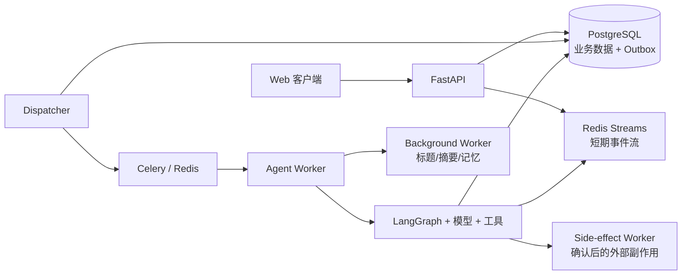
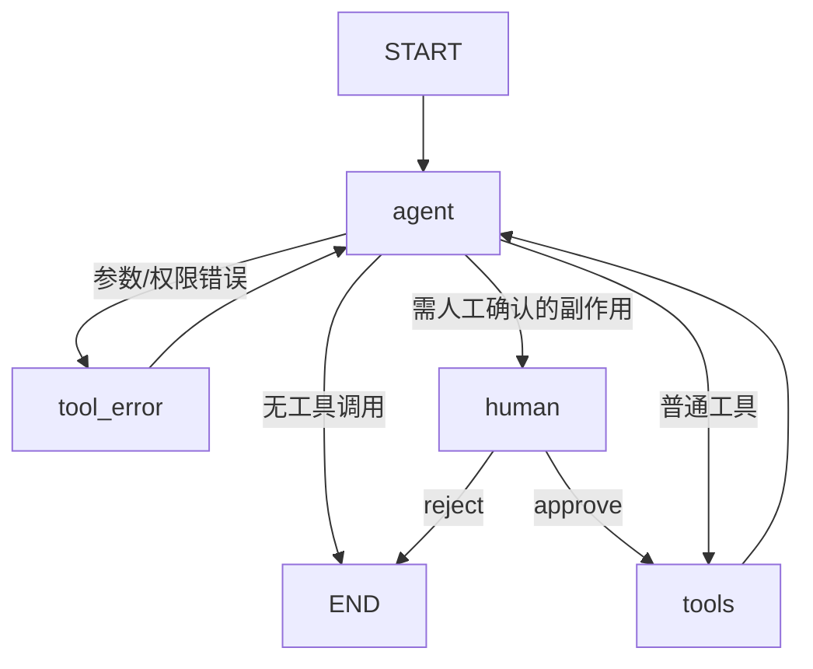

# ContentAI 后端功能设计

> 交接基线：`0.6.0`（2026-07-27）
>
> 本文以当前工作区代码、数据库模型、迁移、测试和容器编排为准。它同时取代旧版 API、产品、架构、会话流水线和开发说明中涉及后端的内容。

## 1. 系统职责与边界

ContentAI 后端提供多租户内容创作 Agent 平台，负责：

- 用户注册、登录、会话 Cookie、CSRF、临时密码和管理员用户治理；
- Agent 配置、不可变版本和会话版本固定；
- 会话、消息、异步执行、SSE 实时事件、取消与人工确认恢复；
- 基于 LangGraph 的工具调用、热点发现、选题研究和带证据输出；
- 短期摘要、长期记忆、研究资料包和 PostgreSQL checkpoint；
- 在线模型配置探测、加密保存、版本化切换和用量统计；
- Outbox、Celery Worker、服务心跳、恢复与副作用一致性。

明确不做的事情：

- 不建立“候选内容/稿件版本”业务实体；最终内容就是普通 Assistant 消息；
- 不抓取搜索结果网页正文，研究仅使用搜索服务返回的标题、摘要、链接等受限字段；
- 不允许已有会话自动切换 Agent 版本；
- 不把 Redis SSE 事件当作业务事实存储；
- 不允许客户端直接指定消息对应的 `agent_id`、模型配置或 LangGraph checkpoint。

## 2. 技术架构

后端基于 Python 3.12、FastAPI、SQLModel/SQLAlchemy、PostgreSQL、Redis、Celery、LangGraph 和 OpenAI-compatible 模型接口。当前共有 35 个公开业务 HTTP 接口，统一位于 `/api`；FastAPI 自带的 `/docs` 和 `/openapi.json` 不计入其中。

一次消息的主链路如下：

API 事务只负责可靠地落库消息、执行记录和 Outbox；Dispatcher 提交后台任务；Agent Worker 执行图；前端从 Redis Stream 收取短期事件，同时以数据库状态作为最终事实源。主执行成功后，标题、摘要和长期记忆异步后处理，后处理失败不会把已完成的主执行改回失败。

## 3. HTTP 接口清单

### 3.1 系统状态

| 方法 | 路径 | 说明 |
| --- | --- | --- |
| GET | `/api/health` | 进程存活检查 |
| GET | `/api/ready` | 数据库、迁移、checkpoint、Redis、Dispatcher、三个 Worker 队列心跳及已发布 Outbox 时效检查 |

### 3.2 认证

| 方法 | 路径 | 说明 |
| --- | --- | --- |
| POST | `/api/auth/register` | 注册并直接创建已验证、启用的普通用户；密码 10–128 字符 |
| POST | `/api/auth/login` | 登录并写入 Session/CSRF Cookie |
| POST | `/api/auth/logout` | 注销当前数据库会话，返回 204 |
| GET | `/api/auth/me` | 返回当前用户身份和强制改密状态 |
| POST | `/api/auth/change-password` | 修改密码、清除临时密码状态并撤销其他会话 |

系统当前没有邮件验证、找回密码或重置密码邮件流程。管理员发放临时密码是唯一的后台重置入口。

### 3.3 Agent

| 方法 | 路径 | 说明 |
| --- | --- | --- |
| GET | `/api/agents` | 当前用户的 Agent 列表 |
| GET | `/api/agents/{agent_id}` | Agent 详情及最新版本 |
| POST | `/api/agents` | 创建 Agent 和版本 1，返回 201 |
| PATCH | `/api/agents/{agent_id}` | 只修改名称和描述 |
| POST | `/api/agents/{agent_id}/versions` | 创建不可变的新版本，返回 201 |
| DELETE | `/api/agents/{agent_id}` | 删除从未被业务数据引用的 Agent，返回 204 |

Agent ID 长度 1–80 且匹配后端规定字符模式；名称、描述、热点评分提示词和内容提示词有严格长度限制。热点来源必须为非空且只能来自支持列表。

### 3.4 会话与执行

| 方法 | 路径 | 说明 |
| --- | --- | --- |
| POST | `/api/chat/sessions` | 以 Agent 最新版本创建会话 |
| GET | `/api/chat/sessions` | 游标分页列出会话 |
| GET | `/api/chat/sessions/{session_id}` | 会话详情和最近消息 |
| DELETE | `/api/chat/sessions/{session_id}` | 删除空闲会话，返回 204 |
| POST | `/api/chat/sessions/{session_id}/messages` | 创建用户消息和异步执行，返回 202 |
| GET | `/api/chat/runs/{execution_id}/events` | SSE 事件流，支持断点续读 |
| GET | `/api/chat/runs/{execution_id}/status` | 执行状态、队列阶段和最终消息 |
| POST | `/api/chat/runs/{execution_id}/cancel` | 取消或申请取消 |
| POST | `/api/chat/runs/{execution_id}/resume` | 对当前中断执行批准/拒绝 |

消息正文最多 8000 字符。`message_id` 和幂等键最多 255 字符；幂等键可放在 `Idempotency-Key` 请求头或请求体，两处同时提供时必须相同。恢复请求只接受 `interrupt_id` 和 `decision: approve | reject`，不接受自由文本。

### 3.5 管理后台

所有接口仅管理员可用。

| 方法 | 路径 | 说明 |
| --- | --- | --- |
| GET | `/api/admin/model-config` | 读取当前生效模型配置，不返回密钥 |
| POST | `/api/admin/model-config/probe` | 探测模型列表、原生工具调用和 JSON Schema 输出能力 |
| PUT | `/api/admin/model-config` | 以 `expected_version` 乐观锁保存并激活新配置 |
| GET | `/api/admin/users` | 筛选、游标分页查询用户 |
| GET | `/api/admin/users/{user_id}` | 用户详情 |
| POST | `/api/admin/users/{user_id}/disable` | 禁用用户并撤销会话/处理运行任务 |
| POST | `/api/admin/users/{user_id}/enable` | 启用用户 |
| POST | `/api/admin/users/{user_id}/temporary-password` | 生成 24 小时一次性展示的临时密码 |
| PATCH | `/api/admin/users/{user_id}` | 修改姓名或角色 |
| GET | `/api/admin/users/{user_id}/sessions` | 用户会话列表 |
| GET | `/api/admin/sessions/{session_id}` | 管理员查看会话元数据 |
| GET | `/api/admin/sessions/{session_id}/messages` | 管理员查看会话消息 |
| GET | `/api/admin/usage` | 按时间、用户、模型、类别查询和聚合模型用量 |

会话、消息和管理列表的 `limit` 默认 50、范围 1–200，游标经过签名，不能由客户端随意拼造。日期输入必须带时区；输出统一为 UTC `Z`。请求模型默认禁止未声明字段。

## 4. 身份认证与安全设计

### 4.1 会话和 CSRF

- 密码使用 pwdlib 推荐的 Argon2 方案散列；不保存明文密码。
- 登录态是数据库 `AuthSession`，Cookie 中只保存随机 Token；数据库保存 Token 和 CSRF Token 的 SHA-256 摘要。
- Session Cookie 为 HttpOnly，CSRF Cookie 可由前端读取；默认 SameSite=Lax，生产环境启用 Secure，默认有效期 30 天。
- 登录后的所有状态变更请求必须携带与 Cookie 对应的 `X-CSRF-Token`。
- 注册和登录默认按客户端 IP 限制为每分钟 10 次；LLM 发送和恢复默认按用户每分钟 30 次、每天 500 次。
- Redis 限流不可用时，开发环境放行便于调试，生产环境拒绝请求并返回 503。
- 连续登录失败默认达到 5 次后锁定 15 分钟。

客户端 IP 只有在直接连接方命中 `CONTENTAI_SERVER__TRUSTED_PROXY_CIDRS` 时才信任 `X-Forwarded-For`。生产反向代理部署必须显式配置可信代理网段，否则限流和审计看到的是代理地址。

### 4.2 Bootstrap 管理员与临时密码

开发和生产启动都要求同时配置 Bootstrap 管理员邮箱、密码。仅当邮箱不存在时创建；已存在用户必须是启用、已验证的管理员，否则启动报冲突。启动过程不会覆盖已有密码或角色。

管理员临时密码：

- 只在创建响应中展示一次，服务器保存散列；
- 有效期 24 小时；
- 用户登录后被限制为仅可调用 `/auth/me`、`/auth/logout` 和 `/auth/change-password`；
- 到期或成功改密都会撤销相关会话；
- 前端不会把临时密码再次持久化展示。

系统禁止管理员自我禁用、自我降级，并在事务级 advisory lock 下保护“最后一个启用管理员”。禁用用户会撤销其登录会话，取消 pending/waiting_input 执行，并为 running 执行写入取消请求。所有管理动作写入审计日志。

### 4.3 通用防护

- 每个请求都有 UUID `X-Request-ID`，错误响应使用稳定错误码；
- 模型配置响应设置 `Cache-Control: no-store`；日志和错误不会返回模型密钥、密文或上游完整响应；
- 生产环境必须配置前端 CORS Origin；任意 localhost 端口只在 development 放行；
- SSE、管理列表和会话消息都有单项/总响应体预算；单项过大返回 413；
- 会话、Agent、执行、研究包和记忆均按用户/版本血缘校验，防止跨租户访问。

## 5. Agent 与版本语义

`AgentProfile` 保存用户可编辑的身份、名称和描述；`AgentVersion` 保存不可变行为配置：热点评分提示词、内容创作提示词和允许的热点来源。创建 Agent 时自动生成 v1；修改行为必须新建版本。

创建会话时固定当时最新的 `agent_version_id`。此后即使 Agent 新建版本，该会话的提示词、工具来源、研究资料和长期记忆仍沿用旧版本。Agent 一旦被会话、调用、执行或记忆引用就不能删除，以保护历史可复现性。

当前支持 23 个逻辑热点来源：

- RSS：36Kr、财联社、经济观察报、第一财经、虎嗅、界面、钛媒体、晚点 LatePost、量子位、雷峰网、财新、Vista 看天下、Financial Times、WSJ、TechCrunch、The Verge、爱范儿、证券时报；
- TikHub：抖音、哔哩哔哩、小红书、微博；
- AI 热榜：AI HOT。

运行时会把工具请求来源与会话固定版本的允许来源取交集，不能绕过 Agent 配置。

## 6. 消息、执行和幂等

### 6.1 创建执行

同一会话最多存在一个 `pending`、`running` 或 `waiting_input` 执行。收到消息后，API 在单一数据库事务中：

1. 加锁并校验用户、会话、Agent、固定版本和忙碌状态；
2. 确认存在已验证、激活的模型配置；
3. 组装有界上下文快照并检查 `context_window - chat_max_output_tokens` 输入预算；
4. 写入用户 `ChatMessage`、`AgentInvocation`、`AgentExecution` 和 `ExecutionOutbox`；
5. 固定本次 `model_config_id`，提交后由 Dispatcher 异步投递。

客户端不提交 `agent_id`。服务端以 URL 中的会话作为唯一来源，并通过复合外键和运行时校验保证 user/session/agent/version/execution 血缘一致。

幂等唯一键为 `(session_id, idempotency_key)`。服务器保存规范化请求摘要：相同键和相同正文返回原执行；相同键但正文变化返回冲突，避免重试生成重复消息。

### 6.2 状态、取消和恢复

主状态为 `pending → running → completed | failed | waiting_input | cancelled`。

- pending 或 waiting_input 取消时立即标为 cancelled；
- running 取消时记录 `cancel_requested_at`，Worker 在模型/工具边界协作式检查；
- status 接口额外返回 `dispatching`、`waiting_worker`、`starting` 等队列阶段；
- waiting_input 恢复时校验公开 `interrupt_id` 和 checkpoint 内工具调用摘要，记录用户批准/拒绝消息及 `ExecutionResumeRequest`，复用同一 execution 重新入 Outbox；
- 批准才执行有副作用工具，拒绝直接结束该条路径。

删除会话要求没有忙碌执行。事务会删除关联记忆和业务数据，并为每个执行写入 `CheckpointDeletionOutbox`；后台随后删除 LangGraph checkpoint 命名空间。审计只保留散列墓碑，不保留用户正文。

## 7. SSE 实时事件与降级恢复

事件写入 Redis Stream，默认 TTL 86400 秒、最大长度 10000。V3 公开事件包含：

- `schema_version = 3`、`execution_id`、递增 `sequence`、`event_id` 和时间；
- `channel`：messages、values、lifecycle、interrupts、errors；
- 可选 namespace、attempt、message/tool 标识和经过清洗的 public data。

SSE 接口支持 `Last-Event-ID` 或 `after_sequence` 续传；15 秒心跳；内部队列上限 256，背压等待 5 秒；响应关闭代理缓冲并允许约 35 分钟长连接。私有提示词、内部状态、凭证和超限负载不会进入公开事件，单个公开负载上限 512 KiB。

Redis 事件只用于体验层。流缺口、过期、读取失败或背压会将执行标为 sticky `streaming_degraded`，不会把已完成业务执行改成失败。前端必须转为轮询 status，并从数据库最终消息恢复。

## 8. LangGraph 对话与工具设计

### 8.1 图结构

单次执行最多 8 次模型迭代，LangGraph recursion limit 默认 20；瞬态模型错误最多重试 3 次。系统提示词要求自然对话，不依赖客户端或模型输出虚构的阶段字段。

### 8.2 当前工具

| 工具 | 作用 | 关键约束 |
| --- | --- | --- |
| `remember` | 写入长期记忆 | 有副作用，必须人工批准；最终由 Side-effect Worker 执行并去重 |
| `recall_memory` | 检索长期记忆 | 最多返回 8 条；按当前用户、Agent/会话范围过滤 |
| `current_datetime` | 返回当前时间 | 默认 `Asia/Shanghai` |
| `fetch_hotspots` | 获取并评分热点 | 只能访问固定版本允许的来源 |
| `prepare_topic_research` | 双搜索源研究选题 | 固定搜索接口、受限字段、引用完整性校验 |

一般工具超时默认 60 秒，热点/研究工具为 180 秒，文本结果默认最大约 240 KiB。审计只保存参数哈希、结果摘要、状态、错误分类和耗时。`remember` 使用 `(execution_id, tool_call_id)` 唯一副作用收据，后台每 30 秒对账，保证至少一次投递下的业务幂等。

为兼容少数模型，运行时能解析受限的 `<invoke>`/system warning 文本工具协议；但管理员探测仍强制要求模型原生工具调用和 JSON Schema 能力，避免把兼容兜底误判为完整支持。

## 9. 热点发现与研究证据链

### 9.1 热点发现

热点聚合按来源隔离失败：单个来源失败不会丢掉其他来源结果。默认每源最多 10 条、原始候选最多 200 条；候选先规范化和跨源去重，再以轮询方式保证来源公平，并生成稳定 `candidate_id`。

用户直接请求“找热点”、实时热点、热搜、热榜、趋势或热门选题时，后端将 `fetch_hotspots` 视为完成该请求的必要前提。模型若在已绑定工具的情况下仍只返回“稍后处理”一类普通文本，图节点会丢弃该文本并补入 `fetch_hotspots` 调用；一旦本轮已有该工具结果，则不会重复抓取。该兜底避免把模型的行动承诺误保存为已完成的 Assistant 回复。

评分调用与主对话隔离，只能看到 `topic_scoring_prompt` 和候选字段，看不到内容提示词、历史对话或 Agent 描述。结构化评分结果按模型选择顺序输出；主 Agent 只收到筛选后的渲染结果，不接收全部原始列表。进度事件包括 `fetching_sources`、`scoring_topics`、`formatting_result` 和来源健康状态。

### 9.2 研究提供方和网络边界

研究只调用固定白名单端点：

- Metaso：`POST https://metaso.cn/api/v1/search`；
- Anspire：`GET https://plugin.anspire.cn/api/ntsearch/search`。

两个提供方并发执行，共享 30 秒抓取预算；每个提供方瞬态失败最多再试 2 次，连续 3 次失败触发 30 秒熔断。成功结果默认缓存 300 秒，失败缓存最长 15 秒。缺少某个可选密钥时，该提供方按失败处理；只要另一方提供合格证据仍可继续。

系统不访问结果 URL 的网页正文。所有 URL 必须是标准 HTTP/HTTPS、无账号信息、无危险端口，拒绝 localhost、链路本地、元数据地址、非全局字面 IP 等 SSRF 目标。标题和摘要经过长度限制、控制字符清理及提示注入隔离；规范 URL 会移除 query 和 fragment 用于去重。

### 9.3 资料包和最终研究消息

清洗后最多保留 20 个来源。没有任何搜索结果返回 `SEARCH_NO_RESULTS`；有结果但没有安全可用证据返回 `CONTENT_EVIDENCE_INVALID`。

结构化 `DeepResearchPackage` 包含核心结论、最多 10 条发现、来源和受限诊断。核心结论及每条发现必须引用至少一个当前允许的 `source_id`；缺失或越权引用会进行一次修复，仍不合格则失败。没有可靠来源标识的风险文本不会进入后续生成上下文。

`prepare_topic_research` 完成后，图不会直接信任模型自由生成的研究正文。模型只能从资料包中选择有效 `claim_id`，后端再确定性渲染带引用和校验证明的“Research-backed findings” Assistant 消息，并校验：

- 当前研究边界后恰好生成一条 Assistant 研究消息；
- package、topic、claims 和 proof digest 一致；
- 所有输出主张均来自已验证资料包。

下一轮用户确认并要求创作时，最新同会话、同 Agent 版本的资料包作为只读上下文加入提示。默认流程要求热点选题先研究、用户再确认、最后创作；用户首次要求跳过研究时模型应提示风险，只有后续明确坚持才可带免责声明直接起草。

## 10. 上下文、摘要与记忆

`ContextAssembler` 依次组合：固定版本的内容提示词、累计短期摘要、相关长期记忆、最近消息、当前会话/版本的最新研究资料和本轮重点消息。默认最近消息上限 40，并至少保留 6 条重点消息。

Token 预算优先使用模型提供方计数器，缺失时使用保守回退，同时计入工具 Schema。API 创建执行前检查一次，Worker 在加载执行本地研究资料后再次检查，防止队列期间上下文增长或配置差异导致超窗。

短期摘要记录处理游标，只对新增消息做增量合并。长期记忆保存于 PostgreSQL，范围必须二选一：Agent 级或 Session 级；类型包括 semantic、episodic、procedural、summary、profile、preference、goal。系统拒绝疑似敏感信息和短暂任务文本，中文检索使用字符 bigram 辅助词法匹配。工具中间 `ToolMessage` 不作为普通聊天正文持久化；最终 Assistant 消息会持久化。

## 11. 模型配置

数据库保存一个当前激活配置和不可变历史版本。配置包含 provider（当前为 `openai_compatible`）、规范化 `base_url`、模型名、可空 temperature、上下文窗口、聊天/结构化最大输出、加密 API Key、密钥指纹/提示、验证状态和创建者。模型 Base URL、API Key、模型名和运行参数只允许通过管理员模型管理接口写入；它们不是环境变量。

保存流程：

1. 使用 `expected_version` 乐观锁避免两名管理员覆盖；
2. 空密钥表示沿用旧密钥，新密钥用 `CONTENTAI_MODEL_CONFIG__ENCRYPTION_KEY` 的 Fernet 加密；
3. 探测 `/models`，响应最多 200 项/256 KiB；
4. 指定模型时再验证原生工具调用和 JSON Schema 结构化输出；
5. 通过后创建新配置并原子切换激活版本。

`temperature = null` 表示调用时省略该参数。`chat_max_output_tokens` 与 `structured_max_output_tokens` 必须小于上下文窗口。每次执行固定配置 ID，运行中切换只影响新执行；Worker 有默认容量 32 的运行时客户端缓存。

Base URL 禁止凭证、query、fragment 和路径穿越。公网及测试解析地址必须 HTTPS；RFC1918 与 `fc00::/7` 企业内网可使用 HTTP/HTTPS。DNS 在每次请求时重新解析并固定连接地址，同时保留正确 Host/SNI；关闭环境代理和重定向，拒绝 loopback、link-local、multicast、unspecified、metadata 和 reserved 地址。

运行时结构化输出首选原生 JSON Schema；兼容回退会要求模型输出严格 JSON 并只解析第一个 JSON 对象，但管理探测不会因回退成功而放宽兼容标准。环境变量只保留 `CONTENTAI_MODEL_CONFIG__ENCRYPTION_KEY`，用于解密数据库中的后台凭证；系统没有环境变量模型回退、在线密钥轮换、删除或一键回滚接口，因此数据库和 Fernet 密钥必须一起备份。

## 12. 数据模型与持久化

| 领域 | 主要表/模型 | 说明 |
| --- | --- | --- |
| 身份 | `AppUser`, `AuthSession` | 用户、角色、锁定/临时密码、数据库登录会话 |
| Agent | `AgentProfile`, `AgentVersion` | 可编辑身份与不可变行为版本 |
| 对话 | `ChatSession`, `ChatMessage` | 固定 Agent 版本的会话和最终可见消息 |
| 执行 | `AgentInvocation`, `AgentExecution`, `AgentExecutionAttempt` | 一次用户意图、当前执行及每次 Worker 尝试 |
| 工具 | `ToolExecution`, `SideEffectReceipt` | 工具审计和副作用幂等收据 |
| 可靠队列 | `ExecutionOutbox`, `ExecutionResumeRequest`, `CheckpointDeletionOutbox` | 首次/恢复投递和 checkpoint 清理 |
| 运行健康 | `ServiceHeartbeat` | Dispatcher、Worker 队列心跳 |
| 上下文 | `MemoryRecord`, `ResearchPackage` | 长期记忆和经过清洗验证的研究资料包 |
| 模型 | `ModelConfiguration`, `ModelUsage` | 加密配置历史和逐次模型调用用量 |
| 审计 | `AdminAuditLog` | 管理动作及删除墓碑，不保存密钥或被删正文 |

复合外键保证租户和执行血缘；业务删除按语义选择级联或拒绝。`ModelUsage.call_id` 唯一，记录输入/输出/总 Token、类别、提供方、模型、耗时、状态和上游是否提供用量。管理员可按日、模型和调用类别汇总。

LangGraph checkpoint 同样位于 PostgreSQL，但使用官方表 `checkpoint_migrations`、`checkpoints`、`checkpoint_blobs`、`checkpoint_writes`，由 `PostgresSaver.setup()` 初始化，不纳入 Alembic。每个 execution 在会话 thread 下使用独立 namespace，避免恢复时串线。

当前只有一个初始 Alembic 迁移：`202607210001_v050_initial_schema.py`，`down_revision = None`，面向全新数据库；没有旧版数据库原地升级链路。

## 13. 异步可靠性

### 13.1 Outbox 与 Dispatcher

Dispatcher 每批加锁领取 50 条 Outbox，使用 `FOR UPDATE SKIP LOCKED` 避免多实例争抢；publishing lease 默认 30 秒。发布失败按 `min(60, 2^attempt)` 秒退避，服务心跳用于 readiness。

### 13.2 Agent Worker

Agent Worker 消费 `agent-executions` 队列，默认并发 4、prefetch 1、late ack、进程丢失拒绝重入队。任务软/硬超时默认 1800/1860 秒，Redis visibility timeout 7200 秒。执行 claim 超时和 lease 默认各 120 秒，15 秒续租，最多 3 次执行尝试；每次尝试独立落库，便于诊断重复投递和崩溃恢复。

### 13.3 后处理和副作用

- Background Worker 默认并发 2，负责标题、累计摘要和长期记忆，最多 3 次尝试，基础退避 5 秒；
- Side-effect Worker（Compose 服务 `side-effect-worker`）默认并发 1，只执行批准后的远程副作用；
- Beat 每 30 秒恢复过期执行、每 30 秒对账副作用、每 10 秒刷新队列心跳；
- readiness 要求 Dispatcher 及三个 Worker 队列心跳在默认 30 秒窗口内新鲜。

## 14. 稳定错误与调用方处理

错误体包含稳定 `code`、面向用户的 `message`，并尽可能附带 request/session/thread/execution 标识。前端和集成方应按 code 分支，不应匹配英文消息。常见错误包括：

| HTTP | Code | 含义 |
| --- | --- | --- |
| 400 | `AGENT_NOT_FOUND` | Agent 不存在或不属于当前用户 |
| 404 | `CHAT_SESSION_NOT_FOUND`, `EXECUTION_NOT_FOUND` | 会话或执行不存在 |
| 409 | 幂等冲突、会话忙、版本冲突 | 需要复用原请求或刷新状态 |
| 413 | `RESPONSE_ITEM_TOO_LARGE` | 单条响应超过安全预算 |
| 422 | `INVALID_CURSOR` | 游标无效、过期或不匹配查询 |
| 429 | 限流/每日模型调用上限 | 稍后重试或联系管理员 |
| 503 | `MODEL_NOT_CONFIGURED` | 尚无可用模型配置 |
| 503 | `MODEL_CONFIG_PERSISTENCE_FAILED` | 已通过探测但持久化/激活失败 |
| 503 | 限流存储或依赖不可用 | 生产环境安全失败 |
| 执行终态 | `SEARCH_NO_RESULTS`, `CONTENT_EVIDENCE_INVALID` 等执行错误 | 不作为同步发送接口错误；通过 execution 状态和公开 error 事件呈现 |

模型探测使用稳定的安全错误，不透传上游响应正文。完整输入校验错误由 FastAPI 422 返回。

## 15. 代码定位与维护约定

| 位置 | 职责 |
| --- | --- |
| `apps/api/src/api/` | FastAPI 路由、依赖和 HTTP/SSE 契约 |
| `apps/api/src/services/` | 会话、执行、鉴权、模型配置、管理等业务服务 |
| `apps/api/src/agent/` | LangGraph 图、上下文、checkpoint、Worker 运行时 |
| `apps/api/src/tools/` | 热点、研究、记忆和工具注册/执行 |
| `apps/api/src/models/` | SQLModel 业务模型 |
| `apps/api/src/contentai_migrations/` | Alembic 初始迁移 |
| `apps/api/src/workers/` | Dispatcher、Celery 任务、恢复和心跳 |
| `apps/api/tests/` | API、并发、恢复、安全、工具和发布契约测试 |

维护时遵循以下不变量：

1. 任何新写入链路必须明确事务边界、幂等键和重试语义；
2. 新工具必须声明只读/副作用、权限、超时、输出预算和审计内容；
3. 任何进入模型的外部文本都视为不可信数据，不能拼接成系统指令；
4. 任何影响会话行为的 Agent 修改都创建新版本；
5. Redis 丢失只能影响流式体验，不能成为消息和执行完成状态的唯一存储；
6. 修改接口、表结构、队列拓扑、环境变量或错误码时，同时更新本文、前端设计文档和部署文档中受影响部分。
